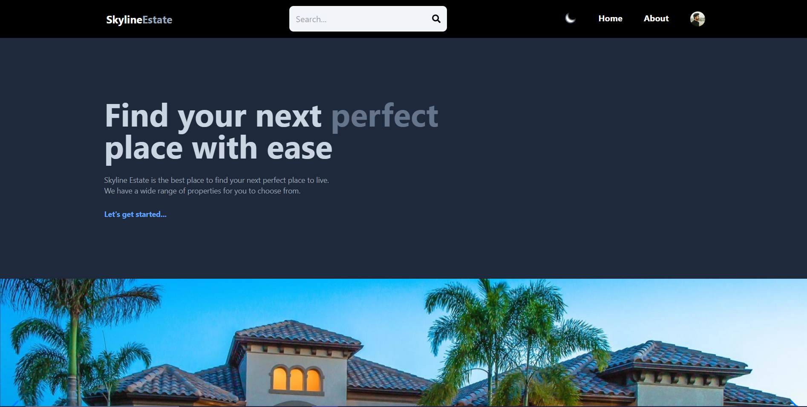

# Real Estate Website

A responsive real estate website built using the power of MERN (MongoDB, Express.js, React, Node.js) stack and TailwindCSS.



## Table of Contents
- [Features](#features)
- [Demo](#demo)
- [Technologies](#technologies)
- [Installation](#installation)
- [Contributing](#contributing)

## Features

- Browse available properties with detailed information 👩‍💻.
- Search for properties by location, type, price range, and more 🔍.
- User authentication and profile management 🔒.
- Add your property to the listing or Edit/Delete them 📦.
- Dark mode to reduce strain on your eyes 😎.
- Contact property owners through the website 📧.
- Admin panel for property management 📃.
- Responsive design for mobile and desktop 📱.

## Demo

You can explore a live demo of the Real Estate Website [here](https://skyline-estate.onrender.com/).

## Technologies

- **Frontend:**
  - React
  - Redux for state management
  - React Router for routing
  - TailwindCSS for styling.

- **Backend:**
  - Node.js with Express.js.
  - MongoDB for the database.
  - Mongoose for MongoDB object modeling.
  - Firebase for Image storage and authentication.
  - JWT for token-based authentication.

## Installation

To run this project locally, follow these steps:

1. Clone the repository:

   ```bash
   git clone https://github.com/R4Rohit23/Real-Estate-Website.git
   ```
2. Go to Frontend Directory

   ```bash
   cd fronend
   ```
   
3. Create '.env' file in frontend folder and set your environment variables fetched from the firebase.
   ```bash
   VITE_FIREBASE_API_KEY = "your_api_key"
   ```
   
4. Install the required packages and run the frontend
   ```bash
   npm install && npm run dev
   ```
   
4. Go to Backend Directory
   ```bash
   cd backend
   ```
5. Create '.env' file in the root directory and set your environment variables:
   ```bash
   MONGO_URI = "your_mongodb_url"
   JWT_SECRET = "your_secret"
   ```
   
6. Install required packages and run the backend
   ```bash
   npm install && npm run dev
   ```

### Contributing
Contributions are welcome! If you'd like to contribute to this project, please follow these guidelines:

1. Fork the repository.
2. Create a new branch for your feature or bug fix.
3. Make your changes and ensure they are well-documented.
4. Open a pull request with a clear title and description.
